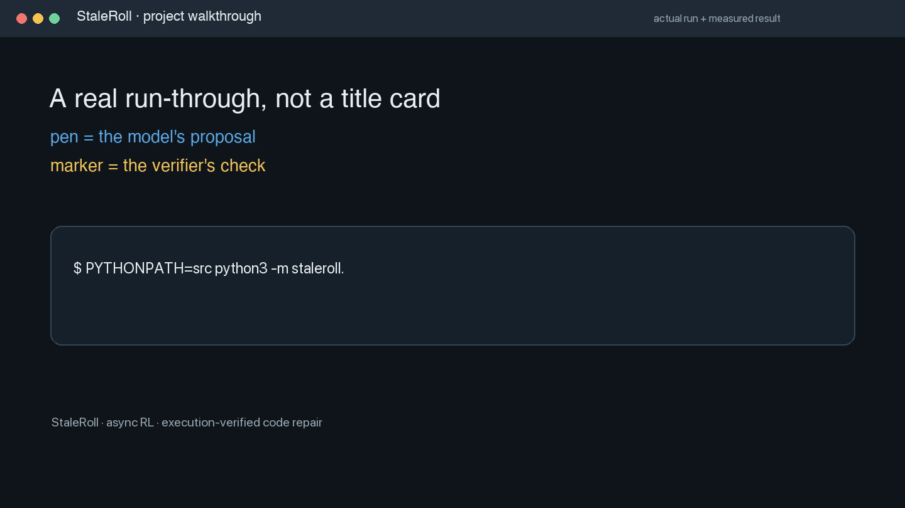

# StaleRoll demo

`staleroll_demo.mp4` is a narrated run-through of the project. It starts with the actual CLI command, shows the smoke-run output, points at the LoRA and controller code, and then highlights the measured 100-task LoRA and frozen-Gemini comparison. The blue pen pointer marks the line being explained; the yellow marker highlights the evidence.

[](staleroll_demo.mp4)

The narration uses Microsoft Emma Neural voice through `edge-tts`, with conversational pacing and short sentences. The source script is in `narration.txt`; the visual and audio build is reproducible with:

```bash
python3 demo/generate_demo.py
```

The demo deliberately states the result as measured: frozen Gemini remains slightly stronger for asynchronous quality, while the LoRA path is trainable locally and has comparable verified throughput. `terminal_run.txt` records the smoke command output used in the walkthrough.
